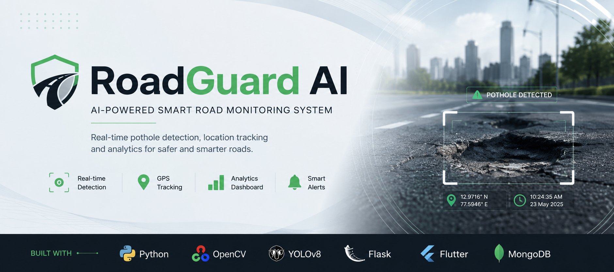
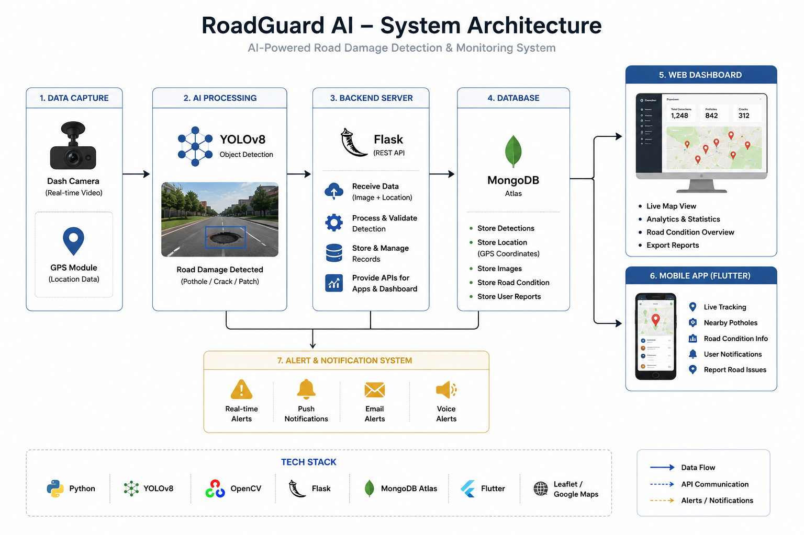
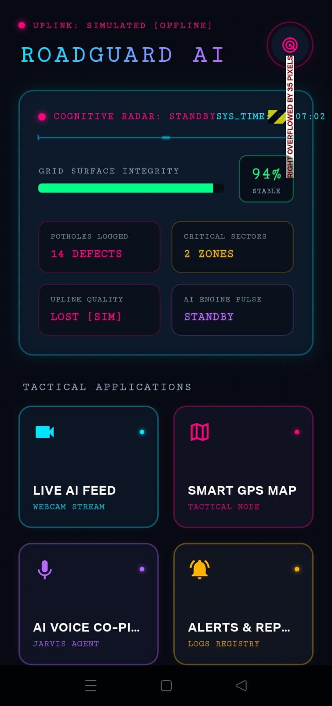
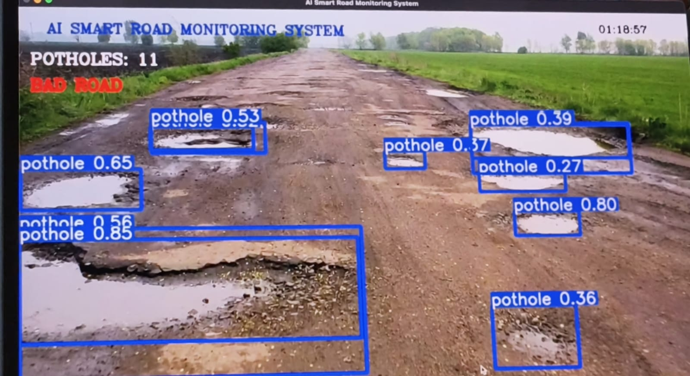
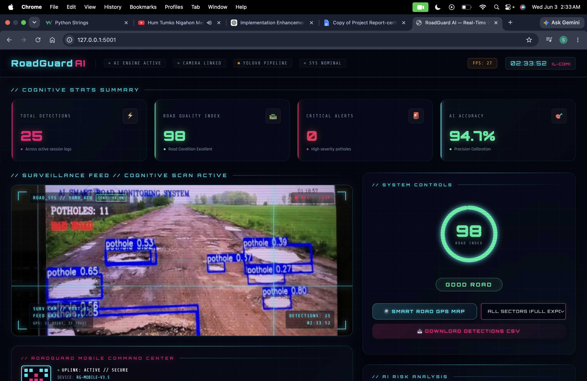
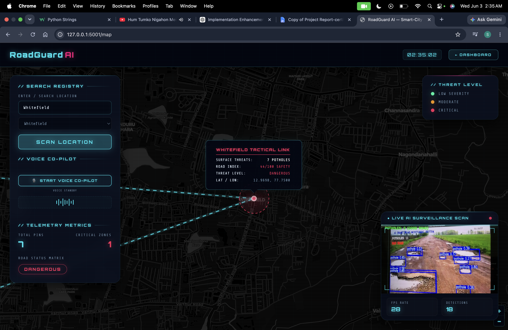
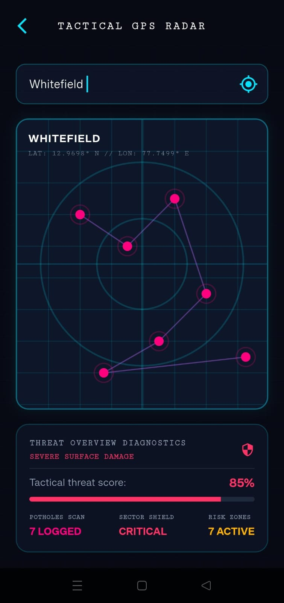
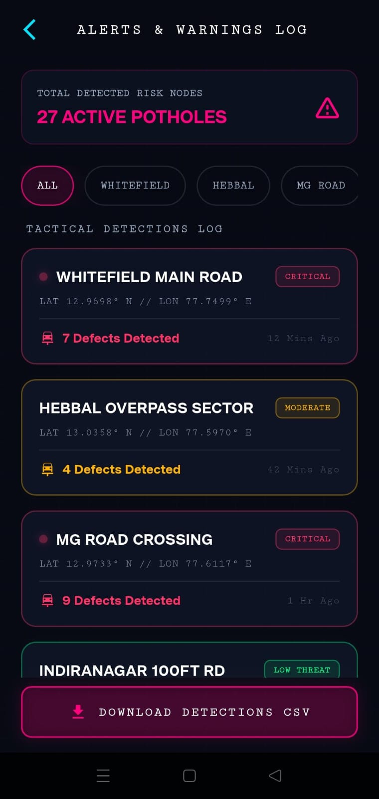
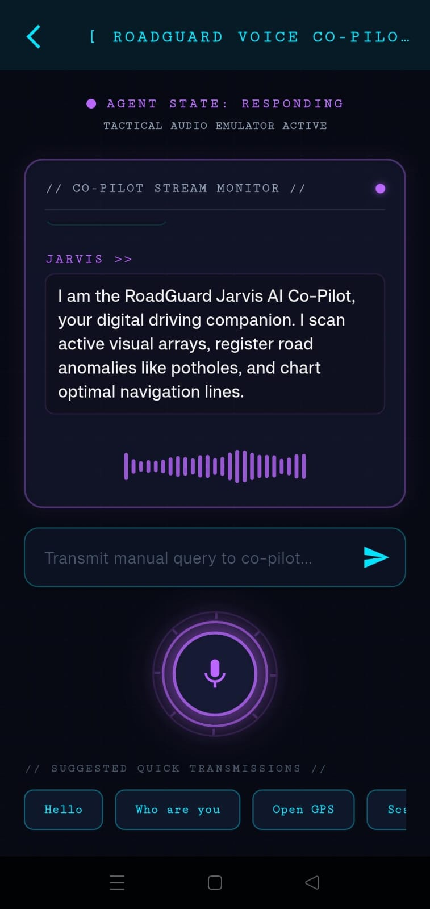

<p align="center">
  
</p>


# 🚗 RoadGuard AI

> AI-powered Road Damage & Pothole Detection System using Flutter, Flask, YOLOv8, OpenCV, and MongoDB.


---

# 🏗️ System Architecture

The RoadGuard AI system captures live road footage, detects potholes using YOLOv8, processes data through a Flask backend, stores information in MongoDB Atlas, and presents the results through a web dashboard and Flutter mobile application with GPS and voice alerts.

<p align="center">
  
</p>

---

---

## 📸 Application Preview

### 🏠 Home Screen


### 🤖 AI Detection


### 📊 Dashboard


### 🗺️ GPS Map


### 📡 GPS Radar


### 🚨 Alerts


### 🎙️ Voice Assistant


---

---

## 📌 Overview

RoadGuard AI is a smart road monitoring system that detects potholes and road damage in real time using Artificial Intelligence.

The system captures live video through a mobile camera, sends frames to a Flask backend running a YOLOv8 model, detects potholes, displays bounding boxes on the mobile application, and stores detection information for visualization on a dashboard.

---

## ✨ Features

- 📱 Flutter Mobile Application
- 🧠 YOLOv8 AI Detection
- 🎥 Real-time Camera Feed
- 📦 Flask Backend Server
- 🖼 OpenCV Image Processing
- 🗺 GPS Location Integration
- 📊 Web Dashboard
- 💾 MongoDB Database
- 🚨 Real-time Road Damage Alerts
- 🎙 AI Voice Co-Pilot (Prototype)

---

## 🛠 Tech Stack

| Technology | Purpose |
|------------|---------|
| Flutter | Mobile Application |
| Python | Backend |
| Flask | REST API Server |
| YOLOv8 | AI Detection Model |
| OpenCV | Image Processing |
| MongoDB | Database |
| REST API | Communication |

---

## 📂 Project Structure

```text
RoadGuard-AI
│
├── assets/
│   ├── banner.png
│   ├── screenshots/
│   └── architecture/
│
├── docs/
│
├── roadguard_mobile_flutter/
│
├── templates/
│
├── app.py
├── app_dashboard.py
├── app_server.py
├── main.py
├── live_camera_detection.py
├── pothole_data.py
├── requirements.txt
└── README.md
```

---


## 🚀 Future Scope

RoadGuard AI 2.0 aims to evolve from a pothole detection prototype into a complete Smart Road Infrastructure Monitoring Platform.

<p align="center">
  
</p>

### Planned Features
- Edge AI Deployment (Jetson Nano / Raspberry Pi)
- Multi-class Road Damage Detection
- Government Analytics Dashboard
- Community Reporting Platform
- Smart Alerts & Voice Assistance
- Route Optimization
- Smart City Integration
- Cloud-based Infrastructure Monitoring

- Cloud Deployment
- ADAS Integration
- Vehicle-to-Vehicle Communication
- Smart City Dashboard
- AI Traffic Analytics
- Government Road Monitoring


---

## 👨‍💻 Author

**Saumil Sikhar**

Information Science & Engineering  
Dayananda Sagar Academy of Technology and Management
, Bengaluru, Karnataka

---

## 📜 License

MIT License

